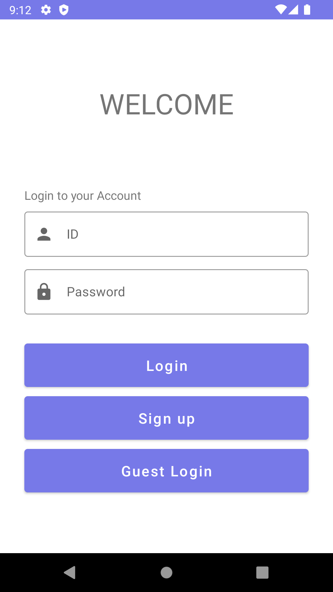
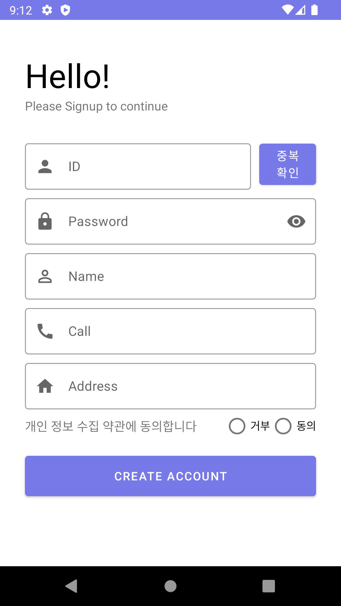
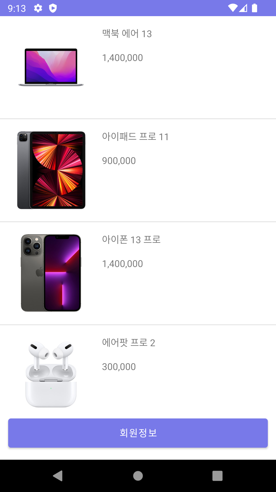

## 개발환경
| 구분           | Version        |
| ------------- | :-----:        |
| Android API   | `31`           |
| Android SDK   | `12(arm 64)`   |
| Device        | `Pixel 2(AVD)` |

## 라이브러리
| 라이브러리           | Version |
| ----------------- | :-----: |
| gson              | `2.8.8` |
| core-splashscreen | `1.0.0` |
| material          | `1.7.0` |

## 실행화면
| Login | SignUp | Main(Product) |
| ----- | :-----: | ----- |
| |  ||

## 구현 내용
### 1. 첫번째 화면(로그인 화면)
- Relative Layout 사용
- 앱 실행시 기존에 회원가입을 진행하여 계정이 존재할 때, 자동으로 ID, PW 입력 됨
- 로그인 버튼을 클릭했을 때, ID또는 PW가 입력되지 않았다면 입력을 요구하는 토스트 메시지 출력,
    - 둘 다 입력이 되었을 때, ID가 기존에 등록된 것이라면 입력된 PW와 비교하여 로그인 성공 토스트메시지 또는 잘못된 비밀번호라고 토스트메시지 출력
    - ID가 기존에 등록된 것이 아니면, 등록되지 않은 아이디라고 토스트메시지 출력
    - 로그인에 성공하면, `intent`에 `userId`, `userInfo(직접 정의한 Member객체)`를 실어서 보냄
- 게스트 버튼을 클릭했을 때, `intent`에 `guest`라는 value를 보내고, 상품 액티비티로 바로 이동
- PW 입력시 EndIcon 을 클릭하면 입력한 패스워드를 한 번에 지울 수 있음

### 2. 두번째 화면(회원가입 화면)
- Linear Layout 사용
- ID 중복검사버튼을 누르면, preferences에 저장되어 있는 `memberHashMap`에서 모든 `key(user_id)`와 비교해 중복이 되는지 확인 후 토스트메시지 출력 및 `cauUseId` 변수를 `true`로 설정
- ID 중복검사를 마치고 나서 변경을 하게 될 경우 id사용 가능 여부를 알 수 없기때문에, `editText`에 `textChangeListener`를 추가해, 입력한 텍스트가 변경 되면 `canUseId` 변수를 `false`로 설정
- PW 조건검사(10자리 이상, 특수문자 1개이상 포함)
- PW 조건검사는 PW입력을 갱신할 때 마다(`textChangeListener`) EditText 바로 아래의 HelperText에서 실시간으로 조건에 맞는지 확인 할 수 있고, EditText의 테두리 색으로도 확인 가능
- PW 입력시 EndIcon 을 클릭하면 입력한 패스워드를 문자로 볼 수 있음
- 이름, 전화번호, 주소, 약관 동의 각각 변수에 할당하여 멤버객체를 생성하여 저장
- ID 중복검사, PW 조건검사, 모든 항목 채움, 약관 동의를 했을 때 Member 객체를 생성하고 preference에 저장 및 상품 페이지로 이동
- preference에 HashMap<String, String>을 저장. 
    - 첫 번째 String은 ID
    - 두번 째 String은 사실 Member타입 이어야 하지만, `eidtor`에 바로 저장 할 수 있는 타입이 아니기 때문에`json String`형태로 변환 후 저장
    - `HashMap`을 `json Stirng`형태로 만들고 `edirtor`에 저장하기 위해 `saveUrlMap`함수 정의
    - `editor`에 있는 `json string`상태의 `HashMap`을 원래 대로 변경 후 사용가능하게 하기위해 `LoadUrlMap`함수 정의

### 3. 세번째 화면
- Constraint Layout 사용
- ListView를 사용하여 5개의 상품 이미지와 가격을 표시
- 화면 아래부분에 회원정보 버튼을 클릭했을 때
    - 회원인 경우(`intent`로 받은 `USER_ID`가 `guest`가 아닌 경우)는 가입했을 때의 정보를 보여주고(Dialog)
    - 회원이 아닌 경우(`intent`로 받은 `USER_ID`가 `guest`인 경우)에는 회원가입을 할지 물어봄(Dialog)
    - 회원가입 의사를 물어보는 Dialog에서 `예`를 누르면 회원가입 페이지 이동, `아니오`를 누르면 Dialog 종료